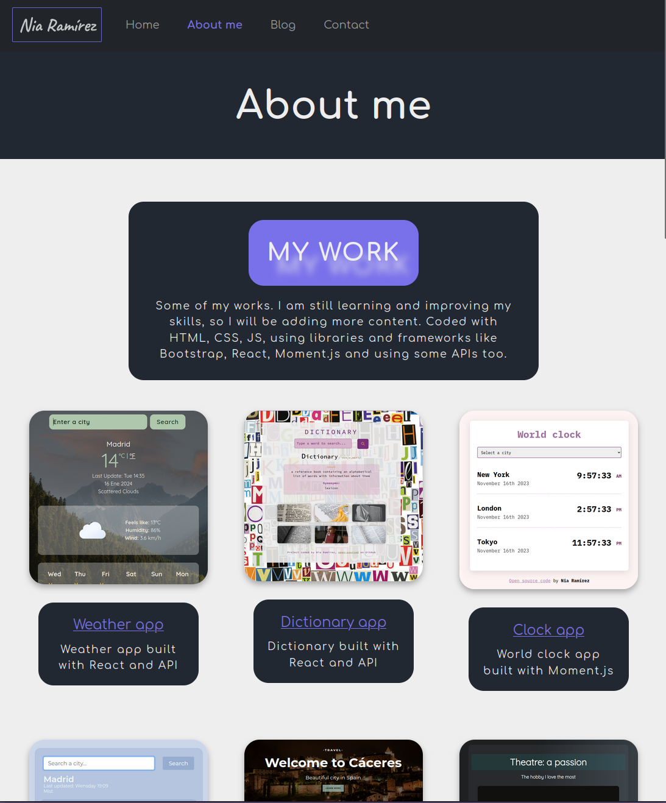
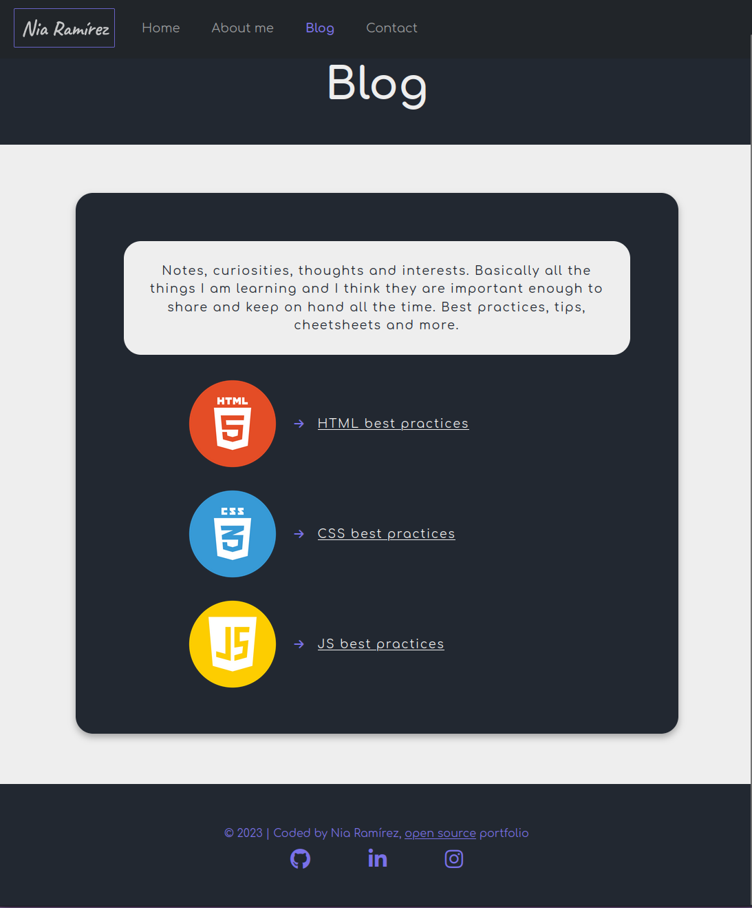

# My Portfolio

Welcome to my portfolio! This repository contains the source code for my personal portfolio website. Here you can find information about my projects, my CV, and my blog where I share various articles and updates.

## Table of Contents

- [My Portfolio](#my-portfolio)
  - [Table of Contents](#table-of-contents)
  - [About](#about)
  - [Features](#features)
  - [Technologies Used](#technologies-used)
  - [Installation](#installation)
  - [Usage](#usage)
  - [Contributing](#contributing)
  - [Overview](#overview)

## About

This is a simple portfolio website that showcases my projects, CV, and blog. The aim of this website is to provide a central place where potential employers, collaborators, and others can learn more about my work and experience.

## Features

- **Home:** Main links to my work and my blog.
- **About:** Detailed descriptions and links to my projects, a section to tell who I am, and a contact section where you can find links to my medias and an accessible and downloadable version of my curriculum vitae.
- **Blog:** A collection of articles where I share my knowledge and interests.

## Technologies Used

- **HTML:** For the structure of the website.
- **CSS:** For styling the website and making it visually appealing.
- **JavaScript:** For adding interactivity and dynamic content to the website.

## Installation

To run this project locally, follow these steps:

1. Clone the repository:
    ```bash
    git clone git@github.com:estefaniaramirezmnt/Portfolio.git
    ```

2. Navigate to the project directory:
    ```bash
    cd Portfolio
    ```

3. Open `index.html` in your web browser to view the portfolio.

## Usage

Feel free to explore the website to learn more about my work and background. You can also read my blog articles for insights and updates on various topics I'm passionate about.

## Contributing

If you would like to contribute to this project, please follow these steps:

1. Fork the repository.
2. Create a new branch (`git checkout -b feature/YourFeature`).
3. Make your changes.
4. Commit your changes (`git commit -m 'Add some feature'`).
5. Push to the branch (`git push origin feature/YourFeature`).
6. Open a pull request.

## Overview




